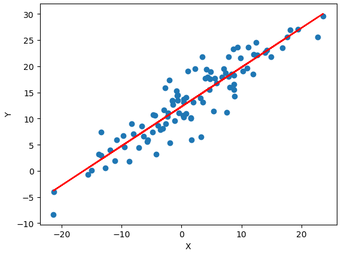
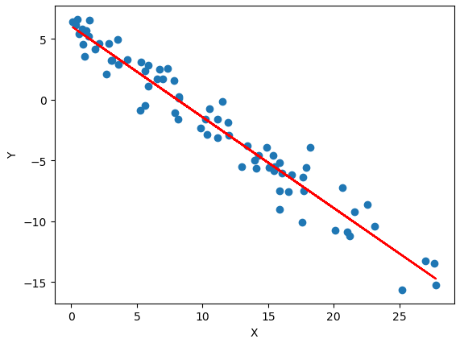
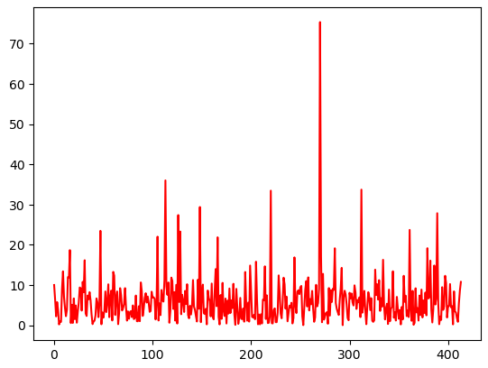

\pagebreak

### Ideas Generales con respecto al trabajo
\
Nuestro objetivo en este trabajo práctico es estudiar el comportamiento de una variable dependiente en relación al un conjunto de variables explicativas para lo cual recurrimos a un modelo de Regresión Lineal Múltiple, en el proceso de plantear este modelo debemos encontrar la fórmula para la solución óptima de $\beta^\ast$ (formula para el coeficiente general de las variables explicativas)
\

### Primera parte. El objetivo de esta sección es deducir una fórmula para la solución óptima $\beta^\ast$ siguiendo los pasos a continuación:

\
(a) Mostrar que el espacio columna de la matriz $X$ es un subespacio vectorial de $R^n$: $Col(X)$ = {b en $R^n$ tales que $b=X\beta$ con $\beta$ variando en $R^p$}
\

Para probar que el espacio columna de la matriz $X$ es un subespacio vectorial de $R^n$ debemos ver que:

  - El vector cero pertenece a $Col(X)$

    Esto es verdadero pues podemos notar que si uno reemplaza $\beta$ por cero ( **0** $\in R^p$), la ecuación resultado será $X0 = b = 0$. Esto podría pasar en una hipotética situación en donde mi ecuación resultado quedaría de la siguiente manera.

    $$y = x_10 + x_20 + ... + x_n0 = 0$$

  - Para cada **u** y **v** en $Col(X)$, la suma **u** $+$ **v** está en $Col(X)$

    Siendo $u=X\beta_u$ y $v=X\beta_v$ , vemos que $u+v = X\beta_u + X\beta_v = X(\beta_u + \beta_v)$ y como sabemos que $\beta \in R^p$ afirmamos que $\beta_u + \beta_v = \beta_{u+v} \in R^p$.

    Por lo tanto $u+v = X\beta_{u+v}$ seguro está en $Col(X)$

  - Para cada **u** en $Col(X)$ y cada escalar $c$, el vector $c$**u** está en $Col(X)$

    Siendo $cu=cX\beta_u$ puedo afirmar que, como $\beta \in R^p$, $c\beta \in R^p$.
    
    Por lo tanto $cX\beta_u = cu \in Col(X)$

\pagebreak
(b) Supongamos que cuando hablamos de vectores en $R^n$ nos referimos a vectores columna de $R^{nx1}$. Mostrar en ese caso que el producto escalar entre dos vectores u, v en Rn puede calcularse como: $u \cdot v = v^Tu$ donde operación en el lado derecho de la igualdad es el producto de matrices usual.
\

Sabiendo que el producto escalar entre dos vectores $u,v$ es:

$$u \cdot v = \sum_{i=1}^{n} u_iv_i = u_1v_1 + u_2v_2 + ... + u_nv_n$$

Y sabiendo que la multiplicacion $v^Tu$ es:

$$\begin{bmatrix}v_1 & v_2 & ... & v_n\end{bmatrix} \begin{bmatrix}u_1 \\ u_2 \\ ... \\ u_n\end{bmatrix} = u_1v_1 + u_2v_2 + ... + u_nv_n$$

Gracias a esto podemos ver ambos lados de la ecuacion concluyen en el mismo resultado.

\
(c) Aplicando el teorema tomando como subespacio $S$ el subespacio del ítem (a), el punto $y$ de $R^n$ como el vector de la variable dependiente, y el vector $b$ como $b=X\beta^\ast$, convertir esta ecuación de optimalidad:

  $$||y-X\beta^\ast|| = \max_{\beta \in R^p} ||y-X\beta||$$

en la condición de ortogonalidad que corresponde a la equivalencia 2 del teorema.
\

Segun lo establecido en el ítem (a) podemos decir que como el subespacio S es igual a Col(X) podemos entender todo valor s $\in$ S como $X\beta = s$

Además, por enunciado podemos decir que $X\beta^\ast = b$

Por lo tanto, la ecuación luego de los reemplazos termina siendo la siguiente:

  $$||y-b|| = \max_{s \in S} ||y-s||$$

Esta ecuacion corresponde a la equivalencia 1 del teorema, demostrando que la misma se cumple para estos parametros. Como llegamos a ver que esta parte del teorema se cumple, podemos afirmar que la equivalencia 2 del mismo teorema también se cumple.

\
(d) A la ecuación obtenida en el ítem (c), aplicarle la identidad del producto escalar vista en el item (b), para llegar a la ecuación:

  $$X^T(y - X\beta^\ast)\cdot \beta = 0$$
\

La ecuacion obtenida en el item (c) es la siguiente:
  
$$(y-b) \cdot s = 0 \; \forall \; s \in S$$

que es igual a, por lo visto en el item (c):

$$(y-X\beta^\ast) \cdot X\beta = 0$$

y al aplicarle la identidad del producto escalar, se trasnforma en:

$$X^T \cdot (y-X\beta^\ast) \cdot \beta = 0$$

que es lo que queriamos.

\
(e) Se sabe que el único vector que es ortogonal a todo vector $v$ de $R^n$ es el vector nulo. Es decir, si $u$ es un vector fijo tal que $u\cdot v = 0$ para todo $v$ en $R^n$, entonces $u = 0$. Usando esto y la ecuación obtenida en el ítem (d), llegar a la fórmula: $X^TX\beta^\ast$ $=$ $X^Ty$
\

La ecuacion obtenida en el item (d) es la siguiente:
  
$$X^T \cdot (y-X\beta^\ast) \cdot \beta = 0$$

Como sabemos que $\beta$ es un vector en $R^n$ podemos afirmar por la propiedad de la consigna que:

$$X^T \cdot (y-X\beta^\ast) = 0$$

\
\
De esta ecuacion podemos simplemente distribuir la multiplicación de la matriz $X^T$, reordenar los termino y llegar a la ecuación objetivo:

$$ X^TX\beta^\ast = X^Ty $$

\
(f) Finalmente, suponiendo que las columnas de $X$ son linealmente independientes, se tiene que la matriz $X^TX$ es invertible. Despejar $\beta^\ast$ de la ecuación del ítem (e) para llegar a la fórmula de la solución óptima al problema de regresión.
\

La ecuacion obtenida en el item (e) es la siguiente:
  
$$X^TX\beta^\ast = X^Ty$$

Gracias a que $X^TX$ es invertible podemos transformarla en:

$$\beta^\ast = (X^TX)^{-1} \cdot X^Ty$$

Que es la formula de la solución óptima al problema de regresión.
\pagebreak

### Segunda parte. En esta sección la idea es realizar regresión lineal en $R^2$ y analizar como se comportan las soluciones obtenidas.

\
1. Usando los datos del archivo ejercicio_1.csv:
    
  (a) Graficar todos los puntos en el plano xy. 

  

  En el gráfico podemos ver todas las observaciones de nuestra muestra. Se puede notar una posible relación lineal entre ambas variables.

  \pagebreak

  (b) Utilizando los conceptos teóricos desarrollados en la primera parte, hallar la recta que mejor aproxima a los datos.
  
  

  En el gráfico podemos ver la superposicion de nuestras observaciones y de nuestra estimación de la recta

  La recta que mejor aproxima a mis datos será $y = X\hat{\beta}$, como $\hat{\beta}$ está en $R^1$ mi recta quedará de la siguiente manera $y = x\hat{\beta_1}$ siendo $\hat{\beta_1}$ la estimación del coeficiente de la primera variable independiente.
  
  \pagebreak

  (c) Realizar nuevamente los incisos (a) y (b) pero considerando los puntos {$(x_i, y_i + 12)$ con $i=1\dots n$} donde $(x_i, y_i)$ eran los puntos originales. ¿Es buena la aproximación realizada?, ¿cuál es el problema?

  

  Esta aproximacion no es buena. El problema con esta es que cuando se hace este tipo de regresion, no se esta teniendo el cuenta la ordenada al origen. Como todos los puntos aumentan en 12 unidades en la cordenanda Y, la ordenada al origen tambien aumenta en 12. En nuestra modelo de regresión no tenemos ningun parametro para la ordenada al origen.

  \pagebreak
  
  (d) ¿Cómo se podría extender el modelo para poder aproximar cualquier recta en el plano?

  Esto se podria solucionar agregando un $\beta_0$ que sea la ordenada al origen para poder estabilizar el gráfico.
  
  Para calcular $\beta_0$ agregamos una columna de unos adelante de la matriz $X$. Agregamos una columna de unos para que cuando hagamos $X\beta$ $\Rightarrow$
  $$\begin{bmatrix}\beta_0 + \beta_1x_{11} + ... + \beta_px_{1p} \\ \beta_0 + \beta_1x_{21} + ... + \beta_px_{2p} \\ ... \\ \beta_0 + \beta_1x_{n1} + ... + \beta_px_{np}\end{bmatrix}$$

  En este caso solo tendriamos $\beta_0$ y $\beta_1$:

  $$\begin{bmatrix}\beta_0 + \beta_1x_{11} \\ \beta_0 + \beta_1x_{21} \\ ... \\ \beta_0 + \beta_1x_{n1}\end{bmatrix}$$

  

  \pagebreak

2. Usando los datos del archivo ejercicio_2.csv:

  (a) Graficar y aproximar los puntos con una recta.
  
  

  En el gráfico podemos ver todas las observaciones de nuestra muestra. Se puede notar una relacion lineal negativa entre ambas variables.

  (b) Imaginemos que los datos forman parte de mediciones de algún tipo, como por ejemplo la temperatura de un procesador a lo largo del tiempo, y queremos predecir cuál va a ser la temperatura en el futuro. ¿Es buena la aproximación que realizamos?, ¿cuál fue el problema en este caso?

  Si agarramos un valor de $x$ muy elevado, generaria un valor de $y$ muy bajo. Si por ejemplo, se estuviese midiendo la temperatura, un valor muy grande en los numeros negativos no tendria sentido, por lo tanto, podríamos decir que nuestro modelo de regresión solamente funciona para parametrso relativamente chicos. Ese punto con un $x$ muy grande seria un Outlier.
\pagebreak

### Tercera parte. En esta sección la idea es realizar regresión lineal con datos reales.

\
1. Teniendo en cuenta la teoría desarrollada en la primer parte del trabajo práctico y usando los datos de entrenamiento

  (a) Estimar los parámetros $\hat{\beta}$ que minimizan el error cuadrático medio para este problema

  Gracias a la formula calculada en la primera parte y de la misma forma que lo calculamos en la segunda parte, usamos la formula de $\hat{\beta}$ para calcularlo.

  (b) Encontrar $\hat{y}$ la estimación de la variable de respuesta.

  Simplemente hacemos el reemplazo en nuestra regresión lineal por el valor $X$ de los datos observados

  (c) ¿Cuánto vale el error cuadrático medio?

  Definimos error cuadrático medio como

  $$ECM(\hat{y}) = \dfrac{1}{n}\sum_{i=1}^{n}(y_i - \hat{y_i})^2$$

  donde $y_i$ son observaciones de una variable y $\hat{y_i}$ estimaciones de las mismas.

  $ECM_e = 82.9635$

  $ECM_t = 58.2295$

\
2. Utilizando los datos de test, analizar cuál es el error cuadrático medio al utilizar los parámetros $\hat{\beta}$ estimados en el punto anterior.

  (a) ¿Es la estimación mejor que sobre los datos originales?, ¿a qué se debe la discrepancia?

  Este $ECM$ nos dio menor al $ECM$ calculado con los datos de entrenamiento. Esto podría deberse a que los valores de test se encuentran más cercanos a la aproximación que se realiza y los datos de entrenamiento presentan puntos mucho más lejanos, estos serían los Outliers.

  (b) ¿Qué sucede con el $ECM$ del segundo conjunto de casas si se realiza la regresión sobre todos los datos al mismo tiempo (es decir, las 414 casas)?

  Cuando se realiza la regresión sobre todos los datos al mismo tiempo mi $ECM$ se parece mucho más al $ECM_t$ que al $ECM_e$.

  $ECM_t = 57.1206$

  Suponemos que esto se debe a que, si bien ahora se incluyen los datos que proporcionaron información que rompía nuestro modelo en el $ECM_e$, estos no son lo suficientes como para contrarrestar la gran magnitud de datos que en el $ECM_t$ son más acertados, es decir, que en los datos totales hay más datos con información más acertada que logra contrarrestar los datos no acertados que están en los datos de $experimento$.

\
3. Graficar el error cometido por cada casa. Es decir el valor absoluto de la diferencia entre el precio por Ping real y el estimado.

  

  En este grafico podemos ver la diferencia de el $y$ real y el $y_{obs}$.

  Gracias a este gráfico podemos notar los como las observaciones de la 1 a la 315 presentan muchas distorsiones con respecto al valor real de $y$ principalemnte vemos como existe un valor que se sobresale del resto, siendo este un Outlier, principal responsable de que nuestra estimación no sea tan buena.

\
4. Imaginemos que se agrega una nueva columna a los datos que informa el año en que la misma fue construida. ¿Disminuiría esto el $ECM$?

  Si agregaramos una columna que indicase el año de construcción de cada casa, esa columna no estaria agregando nada de información, puesto que la columna de edad de las casas me da esa misma información. Agregar una columna que no genera nueva información no mejora el modelo.